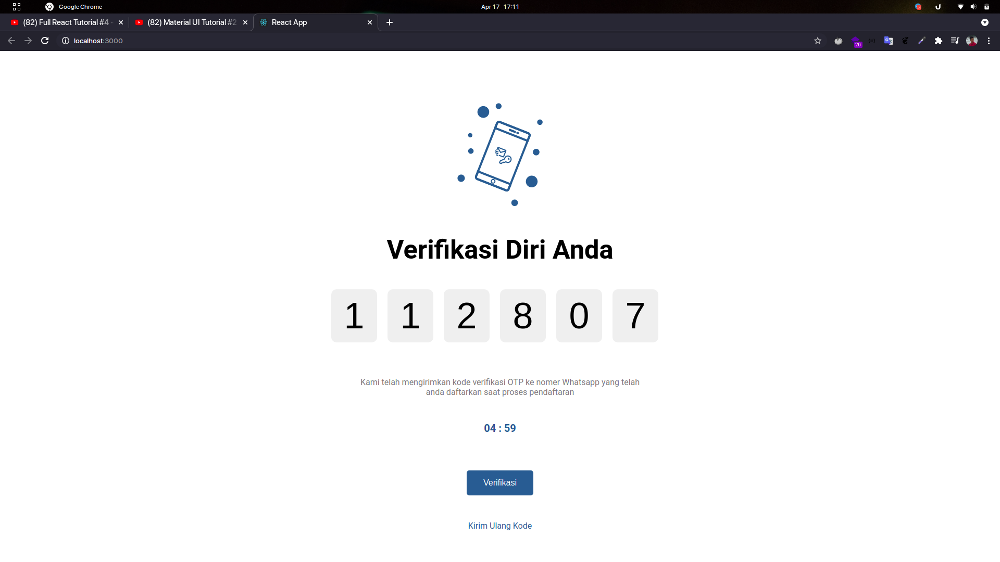

# ReactJS Code Challenge

This project is Challenge to make User Verification Web Page

## Usage

Make sure you have install Node and NPM

1. Clone this project to your computer:

`git clone https://github.com/mkuswari/react-challenge.git`

2. Change Active directory to this project

`cd react-challenge`

3. Install dependency required

`npm install`

4. Run this project

`npm run start`

## Screenshoot

